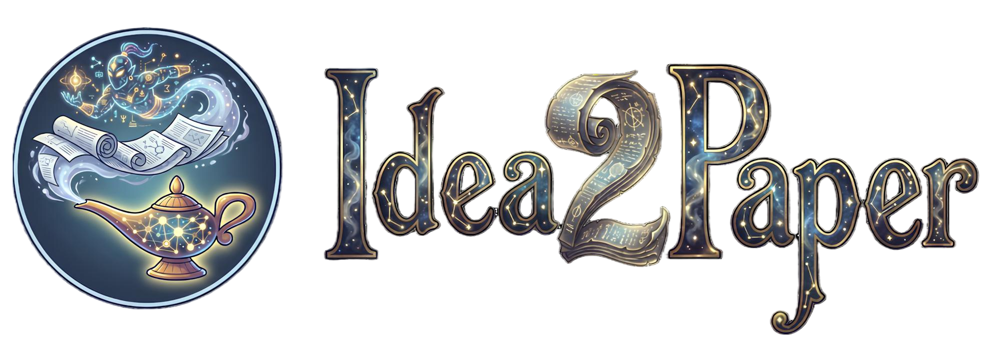

<p align="center">
  
</p>


<div align="center">

[]()
[]()
[](https://arxiv.org/abs/2601.20833)
[](https://github.com/AgentAlphaAGI/Idea2Paper/stargazers)

[English](README.md) | [中文](README-zh_CN.md)

</div>

<details>
  <summary><h2>📌 目录</h2></summary>

  <br/>

  - [📄 Idea2Paper](#-idea2paper)
  - [💬 用户交流群](#用户交流群)
  - [✨ 核心特性](#-核心特性)
  - [📦 输出内容](#-你将得到输出)
  - [🚀 快速开始](#-快速开始)
  - [🤖 锚定式多智能体评审](#-multiagent-review可标定可追溯)
  - [📚 文件与文档](#-files--docs-important-paths)
  - [🤝 贡献指南与许可证](#-contributing--license)
  - [🙏 致谢](#-致谢--credits)
  - [👥 贡献者](#-贡献者--contributors)
  - [📑 引用（Idea2Story）](#-引用idea2story)

</details>


## 📄 Idea2Paper

Idea2Paper 是一个端到端的研究智能体框架，旨在系统地定义和分析当代研究过程中的主要阶段，以及各阶段内在的核心挑战。Idea2Paper 并不将论文写作视为一个单体式的生成问题，而是明确地将科学研究拆解为结构化的阶段，并识别阻碍原始想法转化为连贯、可提交的学术叙事的关键瓶颈。

-  **Idea2Paper** : https://www.researchgate.net/publication/400280248_Idea2Paper_What_Should_an_End-to-End_Research_Agent_Really_Do

### Idea2Story（Idea2Paper 的核心子模块）
Idea2Story 提出了一种以“预计算”为核心驱动的自动化科研叙事生成框架，
将对学术文献的理解从运行时推理（runtime reasoning）
前移至离线的知识图谱构建阶段，从而实现更加高效、稳定且可审计的
自主科学发现流程。

- 🌐 **arXiv**：https://arxiv.org/abs/2601.20833  
- 📘 **PDF**：[papers/Idea2Story.pdf](papers/Idea2Story.pdf)

<div align="center">

<br/>
<em>Idea2Paper 流水线架构</em>
</div>


## 💬 用户交流群

| 微信群                                                                                         | Discord Channel |
|---------------------------------------------------------------------------------------------| --- |
| <p align="center"> <br/>  </p> | https://discord.gg/FfXtbREb |


---

## 📖 项目概述

**Idea2Paper** 是一个把你的研究想法（Idea）自动变成“可投稿论文的 Story（论文叙事骨架）”的端到端流水线。它集成了知识图谱召回、Pattern 选择、Story 生成、可标定 Multi-Agent Review 以及 RAG 查重与智能修正等功能。

> **Idea2Paper** 是一个面向端到端科研流程的总体研究智能体项目。  
> **Idea2Story** 是 Idea2Paper 中的核心子模块，专注于将尚不充分定义的科研想法
> 自动转化为结构完整、可直接投稿的学术论文叙事框架。

### 核心路径
仓库核心路径：`Paper-KG-Pipeline/`

### 运行入口（不变）
```bash
python Paper-KG-Pipeline/scripts/idea2story_pipeline.py "your idea"
```


## ✨ 核心特性

- **🕸️ 知识图谱**：从 ICLR 数据构建 Idea/Pattern/Domain/Paper 节点（当前导出规模示例：Idea 8,284 / Pattern 124 / Domain 98 / Paper 8,285）。
- **🎣 三路召回 + 两阶段加速**：Idea 相似 / Domain 泛化 / Paper 相似；粗排（Jaccard）+ 精排（Embedding）。
- **📝 Idea2Story 生成链路**：Pattern 选择 → Story 生成 → 评审（Anchored Multi‑Agent）→ 智能修正（含 Novelty 模式）。
- **🤖 可标定多智能体评审**：使用论文图谱中的真实 review_stats 作为锚点（anchors），LLM 输出相对比较结果，由确定性算法拟合最终 1~10 分，过程可审计。
- **📊 完整运行日志与审计**：每次 run 建立独立日志目录，记录 events、LLM/embedding 调用输入输出，便于回放与审计。

## 📦 你将得到（输出）

- 📄 `Paper-KG-Pipeline/output/final_story.json`：最终 Story（结构化字段：标题/摘要/问题/方法/贡献/实验等）
- 🔍 `Paper-KG-Pipeline/output/pipeline_result.json`：完整链路结果（包含评审、修正、查重、审计信息）
- 📂 `Paper-KG-Pipeline/log/run_.../`：每次运行的结构化运行日志

## 🚀 快速开始

1. **Python 3.10+**
2. **安装依赖**：
   ```bash
   pip install -r Paper-KG-Pipeline/requirements.txt
   ```
3. **配置**：
   - 复制 `.env.example` -> `.env`，填写 `SILICONFLOW_API_KEY` 等敏感键（不要提交）
   - 可选：复制 `i2p_config.example.json` -> `i2p_config.json` 调整阈值/anchors 等

> **注意：** embedding 模型可通过 `EMBEDDING_MODEL` / `EMBEDDING_API_URL`（环境变量或 `i2p_config.json`）自由切换。切换模型后需重建 novelty/recall 索引，或使用带模型后缀的索引目录以避免不匹配。  
> **约束：** embedding 模型必须输出 **4096 维**向量（与默认 `Qwen/Qwen3-Embedding-8B` 一致）。  
> **推荐（auto_profile）：** 设置 `I2P_INDEX_DIR_MODE=auto_profile`，系统会按 embedding 配置自动切到专属索引目录：`Paper-KG-Pipeline/output/novelty_index__{provider}__{model}__{urlhash}` 和 `.../recall_index__...`。  
> 若显式设置 `I2P_NOVELTY_INDEX_DIR` / `I2P_RECALL_INDEX_DIR`（环境变量或 `i2p_config.json`），会优先使用显式值。  
> **建议（速度/稳定性）：** 建议设置 `I2P_ANCHOR_DENSIFY_ENABLE=0` 以关闭 Adaptive Densify；否则 Phase 3 的 Critic 可能会非常耗时，并且在严格 JSON 校验下更容易因为格式问题失败。  
> **建议（排障）：** 若反复出现 Critic JSON 格式/解析错误，可设置 `I2P_CRITIC_STRICT_JSON=0`（或 `critic.strict_json=false`）关闭严格模式，允许降级继续运行。  
> **当前可直接适配（无需改代码）：** 兼容 OpenAI Embeddings API 的 `/v1/embeddings`（要求 `input` 支持字符串或数组，例如 SiliconFlow、OpenAI 及其它 OpenAI-compatible 服务）。  
> **暂不直接支持：** DashScope/百炼原生 embeddings 接口（`/api/v1/services/embeddings/...`），需要额外适配层。

4. **运行**：
   ```bash
   python Paper-KG-Pipeline/scripts/idea2story_pipeline.py "你的研究Idea描述"
   ```
  
## 🌐 前端（本地 Web UI）

> **状态：** 当前前端仍处于不稳定阶段，建议暂时使用终端运行项目，不要使用前端；后续会持续完善。

运行一个极简的本地 UI，用于启动 pipeline，并且**只展示**高层阶段信息与最终结果（不在页面上展示原始日志内容）。

### 启动

```bash
python frontend/server/app.py --host 127.0.0.1 --port 8080
```

在浏览器中打开：

```text
http://127.0.0.1:8080/
```

### 你可以在 UI 中做什么
- 从网页运行同一个 pipeline 入口 (`idea2story_pipeline.py`) 。
- 为本次运行配置 `SILICONFLOW_API_KEY`, `LLM_API_URL`, `LLM_MODEL` （服务端不会持久化保存）。
- 开关 Novelty / Verification.
- 一键下载本次运行的日志（zip）。

更多说明见 `frontend/README.md`.


## 🤖 Multi‑Agent Review（可标定、可追溯）

核心思想：用真实论文评分分布作为锚点，LLM 做相对比较（better/tie/worse + confidence + rationale），最终分数由确定性算法拟合，使评审结果可复现、可审计。详见仓库 `MULTIAGENT_REVIEW.md`（或 `Paper-KG-Pipeline/docs` 中相应文档）。

## 📚 Files & Docs (Important Paths)

- **Core code**: `Paper-KG-Pipeline/src/idea2paper/`
- **Entry scripts**:
  - `Paper-KG-Pipeline/scripts/idea2story_pipeline.py`
  - `Paper-KG-Pipeline/scripts/simple_recall_demo.py`
- **Scripts layout**:
  - `Paper-KG-Pipeline/scripts/tools/` (build/ETL tools)
  - `Paper-KG-Pipeline/scripts/demos/` (examples)
  - Legacy paths still work (root scripts are thin wrappers)
- **Docs**:

| No. | Document | Content | Target Audience |
| ----- |--------------------------| ---------------- | ------- |
| **0** | [Project Overview](Paper-KG-Pipeline/docs/00_PROJECT_OVERVIEW_zh.md) | Overall architecture, core modules, parameter configuration, execution workflow | Everyone |
| **1** | [Knowledge Graph Construction](docs/01_KG_CONSTRUCTION_zh.md) | Data sources, node/edge definitions, LLM enhancement, how to run | Developers |
| **2** | [Retrieval System](docs/02_RECALL_SYSTEM_zh.md) | Three-way retrieval strategies, similarity computation, performance optimization | Developers |
| **3** | [Idea2Story Pipeline](docs/03_IDEA2STORY_PIPELINE_zh.md) | Pattern selection, Idea fusion, story reflection, critic review | Developers |

- **Multi-Agent details**: [MULTIAGENT_REVIEW.md](MULTIAGENT_REVIEW_zh.md)

## 🤝 Contributing / License

欢迎 PR / Issue。遵循 repo 中的贡献指南与 Code of Conduct。默认 MIT 许可（见 LICENSE）。

## 🙏 致谢 / Credits

- **数据来源**：ICLR（见 docs 中 KG 构建说明）
- **设计灵感**：以可审计的真实锚点为中心的评审流程
- **社区支持**：[agentAlpha 社区](https://agentalpha.top)

## 👥 贡献者 / Contributors

<a href="https://github.com/AgentAlphaAGI/Idea2Paper/graphs/contributors">
  
</a>

## 📑 引用（Idea2Story）

如果你在研究或项目中使用了 **Idea2Story**，请按如下方式引用：

```bibtex
@misc{xu2026idea2storyautomatedpipelinetransforming,
  title={Idea2Story: An Automated Pipeline for Transforming Research Concepts into Complete Scientific Narratives},
  author={Tengyue Xu and Zhuoyang Qian and Gaoge Liu and Li Ling and Zhentao Zhang and Biao Wu and Shuo Zhang and Ke Lu and Wei Shi and Ziqi Wang and Zheng Feng and Yan Luo and Shu Xu and Yongjin Chen and Zhibo Feng and Zhuo Chen and Bruce Yuan and Harry Wang and Kris Chen},
  year={2026},
  eprint={2601.20833},
  archivePrefix={arXiv},
  primaryClass={cs.CE},
  url={https://arxiv.org/abs/2601.20833}
}

```
---

## 📈 Star History

<a href="https://star-history.com/#AgentAlphaAGI/Idea2Paper&Date">
 <picture>
   <source media="(prefers-color-scheme: dark)" srcset="https://api.star-history.com/svg?repos=AgentAlphaAGI/Idea2Paper&type=Date&theme=dark" />
   <source media="(prefers-color-scheme: light)" srcset="https://api.star-history.com/svg?repos=AgentAlphaAGI/Idea2Paper&type=Date" />
   
 </picture>
</a>
